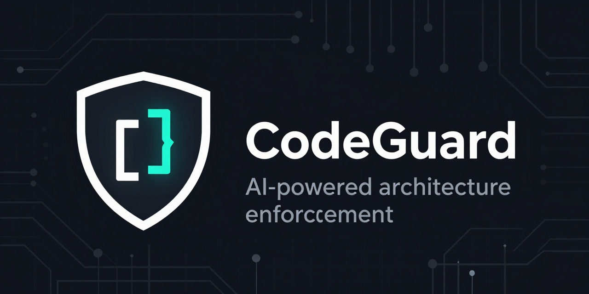

<p align="center">
  
</p>

<p align="center">
  <strong>Your codebase has standards. Now they're enforced.</strong>
</p>

<p align="center">
  <a href="https://www.npmjs.com/package/@henryavila/codeguard"></a>
  <a href="https://github.com/henryavila/codeguard/blob/main/LICENSE"></a>
  <a href="https://www.npmjs.com/package/@henryavila/codeguard"></a>
</p>

---

CodeGuard is an AI-powered code quality guardian that detects your project's architectural patterns and enforces them through **three layers of protection**: prevention at code-generation time, on-demand AI analysis, and deterministic pre-commit hooks.

It doesn't invent rules. It discovers the standards your project already follows — then makes sure every commit respects them.

## The Problem

Your team agreed on architectural patterns: services handle business logic, controllers stay thin, DTOs transfer data between layers. But agreements drift. New team members don't know the rules. AI assistants generate code that looks right but violates your architecture.

Static analysis tools catch type errors. Linters catch formatting. **Nobody catches architectural drift** — until now.

## How It Works

CodeGuard operates in three layers, each catching what the others can't:

```
Layer 1 — Prevention (before code is written)
  CODEGUARD.md is read by your AI IDE automatically.
  The AI generates code that follows your patterns from the start.

Layer 2 — Diagnosis (on-demand)
  /codeguard-run analyzes code against 28 patterns using AI semantic analysis.
  Finds violations that no static tool can detect:
  "This controller is doing business logic" or "This service is returning HTTP responses."

Layer 3 — Protection (every commit)
  Pre-commit hook runs Larastan, PHPMD, Pint, and Pest architecture tests.
  Deterministic. Fast. Blocks violations before they reach the repo.
```

## Quick Start

```bash
# Install into your project
npx @henryavila/codeguard install

# Open your AI IDE and run the setup skill
/codeguard-setup
```

That's it. CodeGuard will:

1. **Detect your stack** (Laravel, PHP version, dependencies)
2. **Scan for patterns** your codebase already follows (services, DTOs, actions, form requests...)
3. **Let you choose** which patterns to enforce and how strictly
4. **Install tools** (Larastan, PHPMD, Pint, Pest) if missing
5. **Generate** `codeguard.yaml`, `CODEGUARD.md`, Pest arch tests, and a pre-commit hook

## What Gets Enforced

### 28 Patterns Across 3 Layers

<details>
<summary><strong>Core — 13 universal patterns</strong> (always active)</summary>

| Pattern | What it catches |
|---------|----------------|
| single-responsibility | Classes doing too many things |
| separation-of-concerns | Mixed presentation, business, and data logic |
| dry | Duplicated business logic (not visual similarity) |
| small-functions | Methods exceeding configured line threshold |
| few-arguments | Functions with more than 7 parameters (SonarQube S107, Miller's Law) |
| no-constructor-many-params | Constructors with too many data parameters |
| no-god-object | Classes with 20+ public methods or 20+ fields (SonarQube/PHPMD) |
| no-deep-inheritance | Inheritance deeper than 6 levels (PHPMD/NDepend/Microsoft CA1501) |
| no-long-switch | Type-dispatching switches that should use polymorphism |
| no-circular-dependencies | Modules depending on each other in cycles |
| layer-dependency-direction | Lower layers depending on higher layers |
| bounded-contexts | Domain concepts leaking across module boundaries |
| consistent-error-handling | Empty catch blocks that silently swallow exceptions |

</details>

<details>
<summary><strong>PHP — 6 language patterns</strong> (active for PHP projects)</summary>

| Pattern | What it catches |
|---------|----------------|
| strict-typing | Missing `declare(strict_types=1)` |
| type-declarations | Missing parameter/return type hints |
| no-html-in-php | HTML mixed into PHP classes |
| no-debug-functions | `dd()`, `dump()`, `var_dump()` left in code |
| no-superglobals | Direct `$_GET`, `$_POST`, `$_SESSION` access |
| exception-handling | Catching `\Exception` instead of specific types |

</details>

<details>
<summary><strong>Laravel — 9 framework patterns</strong> (you choose which to activate)</summary>

| Pattern | What it catches |
|---------|----------------|
| service-layer | Controllers accessing Eloquent directly instead of through Services |
| dto | Raw arrays passed between layers instead of typed DTOs |
| form-requests | Validation logic in controllers instead of FormRequest classes |
| action-classes | Service methods with multiple responsibilities that should be Actions |
| resource-controllers | Controllers with non-RESTful method names |
| value-objects | Primitive obsession where Value Objects would add safety |
| policies | Authorization logic scattered instead of in Policy classes |
| no-env-outside-config | `env()` calls outside of `config/` files |
| no-logic-in-blade | Business logic in Blade templates |

</details>

### 4 Tool Capabilities

| Capability | Tool | Default | Enforcement |
|-----------|------|---------|-------------|
| Static Analysis | Larastan | Level 5 | Block commit |
| Formatting | Pint | Laravel preset | Autofix |
| Mess Detection | PHPMD | codesize, design, unusedcode | Warn |
| Architecture Tests | Pest | PHP + Laravel presets | Block commit |

All thresholds are evidence-based with documented sources (SonarQube, PHPMD, McCabe, Miller's Law). No magic numbers.

## IDE Support

CodeGuard works with any AI IDE that supports agent skills:

| IDE | Status | Install mechanism |
|-----|--------|------------------|
| Claude Code | Supported | Native skills |
| Cursor | Supported | Skills via chat |
| OpenCode | Supported | Native skills |
| Codex CLI | Supported | Skills via copy |
| Gemini CLI | Supported | Skills via symlink |
| GitHub Copilot CLI | Supported | Skills via copy |
| Windsurf | Supported | Skills via copy |

## Skills

### `/codeguard-setup`

Interactive setup that detects your stack, discovers patterns, and generates all configuration files. Run once, update anytime.

### `/codeguard-run`

Full analysis — runs static tools, then AI semantic analysis against all active patterns. Finds what tools can't: architectural violations, missing abstractions, pattern drift.

```
codeguard · analysis report
Scope: Full project

━━━ TOOL FINDINGS ━━━

  ✗ app/Services/OrderService.php:45
    Larastan: Call to undefined method calculateTotal()

━━━ PATTERN ANALYSIS ━━━

  service-layer — Controllers delegate business logic to Services

  ✗ app/Http/Controllers/OrderController.php:31
    Rule: controllers must not access Eloquent models directly
    Found: Order::create($request->all()) called directly in controller
    Fix: Move to OrderService, call $this->orderService->create(OrderData::from($request))

━━━ SUMMARY ━━━

  4 findings · 2 critical · 1 warning · 1 suggestion
```

### `/codeguard-health`

Read-only health check. Shows configuration status, tool versions, baseline freshness, pattern counts, and drift detection.

```
CodeGuard Health Report
=======================

Configuration     [ok] codeguard.yaml found (module: php-laravel, v1.0)
Hook Runner       [ok] .codeguard/hook-runner.js installed
Pre-commit Hook   [ok] .git/hooks/pre-commit active
Baseline          [ok] 12 entries, last updated 2 days ago

Tools
  Larastan (L5)   [ok] vendor/bin/phpstan v2.1.0
  Pint            [ok] vendor/bin/pint v1.21.0
  PHPMD           [ok] vendor/bin/phpmd v2.15.0
  Pest            [ok] vendor/bin/pest v3.7.0

Patterns          28 active (13 core + 6 PHP + 9 Laravel)
Arch Tests        [ok] tests/Architecture/CodeGuardArchTest.php (12 assertions)

No issues found.
```

## Configuration

Everything lives in `codeguard.yaml`:

```yaml
version: "1.0"

project:
  language: php
  framework: laravel
  module: php-laravel

capabilities:
  static-analysis:
    enabled: true
    level: 5          # PHPStan level (5 = recommended minimum)
    enforcement: block
  formatting:
    enabled: true
    enforcement: autofix
  mess-detection:
    enabled: true
    enforcement: warn
  arch-testing:
    enabled: true
    enforcement: block

patterns:
  catalog:
    - service-layer
    - dto
    - form-requests
    - action-classes
  discovered: []      # Patterns found by AI during setup
  custom: []          # Your own patterns in .codeguard/patterns/

thresholds:
  max_method_lines: 30          # Rule of 30 (Lippert/Roock)
  max_indentation_levels: 4     # ESLint/CodeClimate consensus
```

## Adding Custom Patterns

Create a YAML file in `.codeguard/patterns/`:

```yaml
name: result-objects
description: Service methods return Result objects instead of throwing exceptions
category: custom
severity: warning

verification:
  rules:
    - service methods should return Result objects for operations that can fail
    - exceptions should be reserved for truly exceptional circumstances

examples:
  correct: |
    public function processOrder(OrderData $data): OrderResult
    {
        if (!$data->isValid()) {
            return OrderResult::failure('Invalid order data');
        }
        return OrderResult::success($order);
    }
  violation: |
    public function processOrder(OrderData $data): Order
    {
        if (!$data->isValid()) {
            throw new InvalidOrderException(); // Business rule, not exceptional
        }
        return $order;
    }
```

Then add it to `codeguard.yaml`:

```yaml
patterns:
  custom:
    - result-objects
```

## Architecture

```
codeguard/
├── modules/                    # Pattern definitions + tool configs
│   ├── core/                   # 13 universal patterns (SOLID, clean code)
│   │   ├── patterns/*.yaml     # Pattern definitions with verification rules
│   │   └── ai-rules/core.md   # AI analysis instructions + false positive prevention
│   ├── php/                    # 6 PHP-specific patterns
│   └── php-laravel/            # 9 Laravel patterns + tool presets
├── skills/                     # AI agent skills (SKILL.md format)
│   ├── codeguard-setup/        # Interactive project setup
│   ├── codeguard-run/          # Analysis runner
│   └── codeguard-health/       # Health check
├── src/
│   ├── adapters/               # Tool adapters (Larastan, PHPMD, Pint, Pest)
│   ├── cli/                    # CLI + skill deployer + IDE registry
│   ├── core/                   # Config loader, schema validation, types
│   └── hooks/                  # Pre-commit hook runner (self-contained bundle)
└── bin/codeguard.js            # CLI entry point
```

### Module Hierarchy

Patterns cascade from universal to specific:

```
core/ (13 patterns)  →  Always active, every project
  └── php/ (6 patterns)  →  Active for PHP projects
       └── php-laravel/ (9 patterns)  →  Active for Laravel projects
```

More specific layers can override less specific ones. Core and language patterns are always active. Framework patterns are selected during setup.

## Extending

CodeGuard is designed to support any language and framework. To add a new module:

1. Create `modules/{lang}-{framework}/module.yaml` with detection heuristics
2. Add `patterns/*.yaml` with verification rules and examples
3. Add `ai-rules/*.md` with analysis instructions
4. Optionally add tool adapters in `src/adapters/`

The three-layer model (core → language → framework) means your new module automatically inherits all core and language patterns.

## Requirements

- Node.js >= 20
- Git repository
- PHP project with Composer (for Laravel module)

## License

MIT
